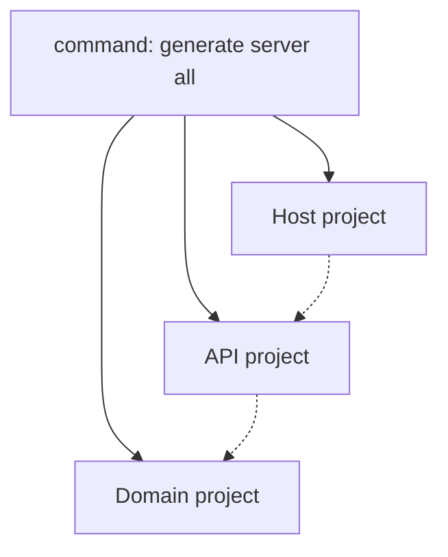

[](https://www.nuget.org/packages/atc-rest-api-generator)

# ATC.Net Rest API Generator

## Breaking changes


```powershell
 * CLI package renamed from 'atc-api-gen' to 'atc-rest-api-generator'
 * CLI tool renamed from 'atc-api' to 'atc-rest-api-generator'
 * atc-rest-api-generator validate schema command
    setting --strictMode renamed to --validate-strictMode
    setting --operationIdCasingStyle renamed to --validate-operationIdCasingStyle
    setting --modelNameCasingStyle renamed to --validate-modelNameCasingStyle
    setting --modelPropertyNameCasingStyle renamed to --validate-modelPropertyNameCasingStyle
* atc-rest-api-generator options-file validate command
* atc-rest-api-generator options-file create command
 * Api-Options file
    Generator->UseNullableReferenceTypes has been removed (default in c# 10)
 ```

## Projects in the repository

|Project|Target Framework|Description|Docs|Nuget Download Link|
|---|---|---|---|---|
|[Atc.Rest.ApiGenerator](src/Atc.Rest.ApiGenerator)|net6.0|Atc.Rest.ApiGenerator is a WebApi C# code generator using a OpenApi 3.0.x specification YAML file.|[References](docs/CodeDoc/Atc.Rest.ApiGenerator/Index.md)<br/>[References extended](docs/CodeDoc/Atc.Rest.ApiGenerator/IndexExtended.md)|[](https://www.nuget.org/packages/Atc.Rest.ApiGenerator)|
|[Atc.Rest.ApiGenerator.CLI](src/Atc.Rest.ApiGenerator.CLI)|net6.0|A CLI tool that use Atc.Rest.ApiGenerator to create/update a project specified by a OpenApi 3.0.x specification YAML file.||[](https://www.nuget.org/packages/atc-rest-api-generator)|

## CLI Tool

The `atc-rest-api-generator` is a cross platform command line application known as CLI tool.

The main purpose of this application is to create and maintain a REST-API service based on an Open-API specification file. So the consept is the `Design First` approse.
And the `atc-rest-api-generator` should be categorized as a `Rapid Application Development Tool` for REST-API in .NET/C#.

### Requirements

* [.NET 6 SDK](https://dotnet.microsoft.com/en-us/download/dotnet/6.0)

### Installation

The tool can be installed as a .NET Core global tool by the following command

```powershell
dotnet tool install --global atc-rest-api-generator
```

or by following the instructions [here](https://www.nuget.org/packages/atc-rest-api-generator/) to install a specific version of the tool.

A successful installation will output something like

```powershell
The tool can be invoked by the following command: atc-rest-api-generator
Tool 'atc-rest-api-generator' (version '2.0.xxx') was successfully installed.`
```

### Update

The tool can be updated by following command

```powershell
dotnet tool update --global atc-rest-api-generator
```

### Usage

Since the tool is published as a .NET Tool, it can be launched from anywhere using any shell or command-line interface by calling **atc-rest-api-generator**. The help information is displayed when providing the `--help` argument to **atc-rest-api-generator**

#### Option <span style="color:yellow">-h | --help</span>
```powershell
atc-rest-api-generator -h

USAGE:
    atc-rest-api-generator.exe [OPTIONS]

OPTIONS:
    -h, --help       Prints help information
    -v, --verbose    Use verbose for more debug/trace information
        --version    Display version

COMMANDS:
    options-file    Commands for the options file 'ApiGeneratorOptions.json'
    generate        Operations related to generation of code
    validate        Operations related to validation of specifications
```

#### Option <span style="color:yellow">generate server all -h</span>
```powershell
atc-rest-api-generator generate server all -h

USAGE:
    atc-rest-api-generator.exe generate server all [OPTIONS]

OPTIONS:
    -h, --help                                                                    Prints help information
    -v, --verbose                                                                 Use verbose for more debug/trace information
    -s, --specificationPath <SPECIFICATIONPATH>                                   Path to Open API specification (directory, file or url)
        --optionsPath [OPTIONSPATH]                                               Path to options json-file
        --validate-strictMode                                                     Use strictmode
        --validate-operationIdCasingStyle [OPERATIONIDCASINGSTYLE]                Set casingStyle for operationId. Valid values are: CamelCase (default), KebabCase, PascalCase, SnakeCase
        --validate-modelNameCasingStyle [MODELNAMECASINGSTYLE]                    Set casingStyle for model name. Valid values are: CamelCase, KebabCase, PascalCase (default), SnakeCase
        --validate-modelPropertyNameCasingStyle [MODELPROPERTYNAMECASINGSTYLE]    Set casingStyle for model property name. Valid values are: CamelCase (default), KebabCase, PascalCase, SnakeCase
        --useAuthorization                                                        Use authorization
    -p, --projectPrefixName <PROJECTPREFIXNAME>                                   Project prefix name (e.g. 'PetStore' becomes 'PetStore.Api.Generated')
        --outputSlnPath <OUTPUTSLNPATH>                                           Path to solution file (directory or file)
        --outputSrcPath <OUTPUTSRCPATH>                                           Path to generated src projects (directory)
        --outputTestPath [OUTPUTTESTPATH]                                         Path to generated test projects (directory)
        --disableCodingRules                                                      Disable ATC-Coding-Rules
```

#### Command <span style="color:yellow">options-file</span>
```powershell
USAGE:
    atc-rest-api-generator.exe options-file [OPTIONS] <COMMAND>

EXAMPLES:
    atc-rest-api-generator.exe options-file create
    atc-rest-api-generator.exe options-file validate

OPTIONS:
    -h, --help    Prints help information

COMMANDS:
    create      Create default options file 'ApiGeneratorOptions.json' if it doesn´t exist
    validate    Validate the options file 'ApiGeneratorOptions.json'
```

#### Default options-file - ApiGeneratorOptions.json
```json
{
  "generator": {
    "useAuthorization": false,
    "useRestExtended": true,
    "request": {},
    "response": {
      "useProblemDetailsAsDefaultBody": false
    }
  },
  "validation": {
    "strictMode": false,
    "operationIdCasingStyle": "CamelCase",
    "modelNameCasingStyle": "PascalCase",
    "modelPropertyNameCasingStyle": "CamelCase"
  }
}
```

## PetStore Example

The following command will generate an API that implements the offcial Pet Store example from Swagger.

```powershell
atc-rest-api-generator generate server all `
    --validate-strictMode `
    -s https://raw.githubusercontent.com/OAI/OpenAPI-Specification/master/examples/v3.0/petstore.yaml `
    -p PetStore `
    --outputSlnPath <MY_PROJECT_FOLDER> `
    --outputSrcPath <MY_PROJECT_FOLDER>\src `
    --outputTestPath <MMY_PROJECT_FOLDER>\test `
    -v
```

Replace `<MY_PROJECT_FOLDER>` with an absolute path where you want to projects created. For example,
to put the generated solution in a folder called `C:\PetStore`, do the following:

```powershell
atc-rest-api-generator generate server all `
    --validate-strictMode `
    -s https://raw.githubusercontent.com/OAI/OpenAPI-Specification/master/examples/v3.0/petstore.yaml `
    -p PetStore `
    --outputSlnPath C:\PetStore `
    --outputSrcPath C:\PetStore\src `
    --outputTestPath C:\PetStore\test `
    -v
```

Running the above command produces the following output:

```powershell
     _      ____    ___      ____                                        _
    / \    |  _ \  |_ _|    / ___|   ___   _ __     ___   _ __    __ _  | |_    ___    _ __
   / _ \   | |_) |  | |    | |  _   / _ \ | `_ \   / _ \ | `__|  / _` | | __|  / _ \  | `__|
  / ___ \  |  __/   | |    | |_| | |  __/ | | | | |  __/ | |    | (_| | | |_  | (_) | | |
 /_/   \_\ |_|     |___|    \____|  \___| |_| |_|  \___| |_|     \__,_|  \__|  \___/  |_|

🔽 Fetching api specification
     Download from: https://raw.githubusercontent.com/OAI/OpenAPI-Specification/master/examples/v3.0/petstore.yaml
     Download time: 390.229 ms
🔍 Working on validation
     CR0103: Schema - Missing title on object type '#/components/schemas/Pet'.
     CR0101: Schema - Missing title on array type '#/components/schemas/Pets'.
     CR0103: Schema - Missing title on object type '#/components/schemas/Error'.
     CR0203: Operation - OperationId should start with the prefix 'Get' or 'List' for operation 'showPetById'.
     CR0214: Operation - Missing NotFound response type for operation 'ShowPetById', required by url parameter.
🔷 Working on server api generation (PetStore.Api.Generated)
     CR0801 - Old project does not exist
🟢   src:  PetStore.Api.Generated.csproj created
🟢   src:  ApiRegistration.cs created
🟢   src:  Contracts\Pets\Models\Error.cs created
🟢   src:  Contracts\Pets\Models\Pet.cs created
🟢   src:  Contracts\Pets\Models\Pets.cs created
🟢   src:  Contracts\Pets\Parameters\ListPetsParameters.cs created
🟢   src:  Contracts\Pets\Parameters\ShowPetByIdParameters.cs created
🟢   src:  Contracts\Pets\Results\ListPetsResult.cs created
🟢   src:  Contracts\Pets\Results\CreatePetsResult.cs created
🟢   src:  Contracts\Pets\Results\ShowPetByIdResult.cs created
🟢   src:  Contracts\Pets\Interfaces\IListPetsHandler.cs created
🟢   src:  Contracts\Pets\Interfaces\ICreatePetsHandler.cs created
🟢   src:  Contracts\Pets\Interfaces\IShowPetByIdHandler.cs created
🟢   src:  Endpoints\PetsController.cs created
🔷 Working on server domain generation (PetStore.Domain)
🟢   src:  PetStore.Domain.csproj created
🟢   src:  DomainRegistration.cs created
🟢   src:  Handlers\Pets\ListPetsHandler.cs created
🟢   src:  Handlers\Pets\CreatePetsHandler.cs created
🟢   src:  Handlers\Pets\ShowPetByIdHandler.cs created
🔶 Working on server domain unit-test generation (PetStore.Domain.Tests)
🟢   test: PetStore.Domain.Tests.csproj created
🟢   test: Handlers\Pets\Generated\ListPetsHandlerGeneratedTests.cs created
🟢   test: Handlers\Pets\ListPetsHandlerTests.cs created
🟢   test: Handlers\Pets\Generated\CreatePetsHandlerGeneratedTests.cs created
🟢   test: Handlers\Pets\CreatePetsHandlerTests.cs created
🟢   test: Handlers\Pets\Generated\ShowPetByIdHandlerGeneratedTests.cs created
🟢   test: Handlers\Pets\ShowPetByIdHandlerTests.cs created
🔷 Working on server host generation (PetStore.Api)
🟢   src:  PetStore.Api.csproj created
🟢   src:  Properties\launchSettings.json created
🟢   src:  Program.cs created
🟢   src:  Startup.cs created
🟢   src:  web.config created
🟢   src:  ConfigureSwaggerDocOptions.cs created
🔶 Working on server host unit-test generation (PetStore.Api.Tests)
🟢   test: PetStore.Api.Tests.csproj created
🟢   test: WebApiStartupFactory.cs created
🟢   test: WebApiControllerBaseTest.cs created
🟢   test: Endpoints\Pets\Generated\ListPetsHandlerStub.cs created
🟢   test: Endpoints\Pets\Generated\ListPetsTests.cs created
🟢   test: Endpoints\Pets\Generated\CreatePetsHandlerStub.cs created
🟢   test: Endpoints\Pets\Generated\CreatePetsTests.cs created
🟢   test: Endpoints\Pets\Generated\ShowPetByIdHandlerStub.cs created
🟢   test: Endpoints\Pets\Generated\ShowPetByIdTests.cs created
🟢   root: PetStore.sln created
🟢   root: PetStore.sln.DotSettings created
📐 Working on Coding Rules files
🟢   root: atc-coding-rules-updater.json created
🟢   root: atc-coding-rules-updater.ps1 created
🐭 Working on EditorConfig files
     Download from: [GitHub] /atc-net/atc-coding-rules/main/distribution/dotnet6/.editorconfig
     Download time: 27.947 ms
🟢   root: .editorconfig created
     Download from: [GitHub] /atc-net/atc-coding-rules/main/distribution/dotnet6/src/.editorconfig
     Download time: 22.987 ms
🟢   src: .editorconfig created
     Download from: [GitHub] /atc-net/atc-coding-rules/main/distribution/dotnet6/test/.editorconfig
     Download time: 24.465 ms
🟢   test: .editorconfig created
🔨 Working on Directory.Build.props files
     Download from: [GitHub] /atc-net/atc-coding-rules/main/distribution/dotnet6/Directory.Build.props
     Download time: 20.880 ms
🟢   root: Directory.Build.props created
     Download from: [GitHub] /atc-net/atc-coding-rules/main/distribution/dotnet6/src/Directory.Build.props
     Download time: 48.340 ms
🟢   src: Directory.Build.props created
     Download from: [GitHub] /atc-net/atc-coding-rules/main/distribution/dotnet6/test/Directory.Build.props
     Download time: 29.480 ms
🟢   test: Directory.Build.props created
✅ Done
```

After the generator is finished running, you can start the API by running the following command:

```
dotnet run --project C:\PetStore\src\PetStore.Api
```

And then open a browser with url: https://localhost:5001/swagger

So what have we genereted by using the command:



- The Host-project is the layer for the `.NET Core API` application. Project suffix: `.Api`.
- The API-project is the layer with all the contracts, interfaces and endpoints. Project suffix: `.Api.Generated`.
- The Domain-project is the layer where you can implement the all the handlers with the actual bussiness logic you have. Project suffix: `.Domain`.


## How to contribute

[Contribution Guidelines](https://atc-net.github.io/introduction/about-atc#how-to-contribute)

[Coding Guidelines](https://atc-net.github.io/introduction/about-atc#coding-guidelines)
