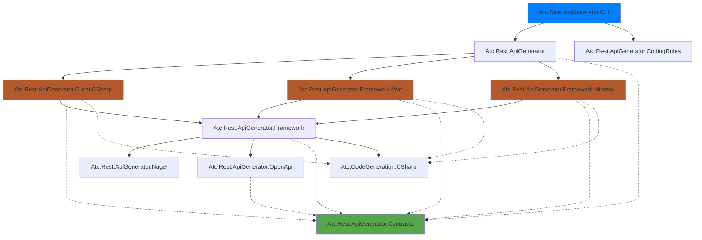
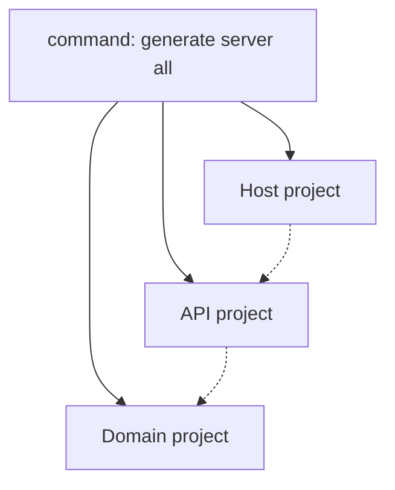

[](https://www.nuget.org/packages/atc-rest-api-generator)

# ATC-NET REST API Generator


## Projects in the repository

|Project|Target Framework|Description|Nuget Download Link|
|---|---|---|---|
|[Atc.Rest.ApiGenerator](src/Atc.Rest.ApiGenerator) | net8.0 | Atc.Rest.ApiGenerator is a WebApi C# code generator using a OpenApi 3.0.x specification YAML file. | [](https://www.nuget.org/packages/Atc.Rest.ApiGenerator) |
|[Atc.Rest.ApiGenerator.CLI](src/Atc.Rest.ApiGenerator.CLI) |net8.0 | A CLI tool that use Atc.Rest.ApiGenerator to create/update a project specified by a OpenApi 3.0.x specification YAML file. | [](https://www.nuget.org/packages/atc-rest-api-generator) |
|[Atc.Rest.ApiGenerator.CodingRules](src/Atc.Rest.ApiGenerator.CodingRules) | net8.0| Create/update atc coding rules for the generated code |
|[Atc.Rest.ApiGenerator.Contracts](src/Atc.Rest.ApiGenerator.Contracts) | net8.0| Shared contracts and interfaces for the generated code. |
|[Atc.Rest.ApiGenerator.Framework.Mvc](src/Atc.Rest.ApiGenerator.Framework.Mvc) | net8.0| Provides support for generating ASP.NET MVC / Controller based REST API server implementations. |
|[Atc.Rest.ApiGenerator.Framework.Minimal](src/Atc.Rest.ApiGenerator.Framework.Minimal) | net8.0| Provides support for generating MinimalAPI based REST server implementations. |
|[Atc.Rest.ApiGenerator.Client.CSharp](src/Atc.Rest.ApiGenerator.Client.CSharp) | net8.0| Generates C# client code for interacting with the generated REST APIs. |
|[Atc.Rest.ApiGenerator.Framework](src/Atc.Rest.ApiGenerator.Framework) | net8.0| Shared framework components and utilities for the API generator projects. |
|[Atc.Rest.ApiGenerator.OpenApi](src/Atc.Rest.ApiGenerator.OpenApi) | net8.0| Handles OpenAPI specification parsing and manipulation for the API generator. |
|[Atc.Rest.ApiGenerator.Nuget](src/Atc.Rest.ApiGenerator.Nuget) | net8.0| Manages NuGet packages required by the generated code and frameworks. |
|[Atc.CodeGeneration.CSharp](src/Atc.CodeGeneration.CSharp) | net8.0| Provides utilities and functionalities for generating C# code. |


## Project dependency graph



## CLI Tool

The `atc-rest-api-generator` is a cross platform command line application known as CLI tool.

The main purpose of this application is to create and maintain a REST-API based on an Open-API specification file using a `Design First` approach.

The `atc-rest-api-generator` can be categorized as a `Rapid Application Development Tool` for REST-API in .NET/C#.

## Prerequisites

To get the benefit out of this CLI tool, a `Design first` approach of the REST API in a `OpenAPI specification` should be in effect. The CLI tool needs a `OpenAPI specification` in `yaml` or `json` file format provided as the argument value for parameter `--specificationPath` or the short-hand-version `-s`.

Read more about REST API design in [ATC DevOps Playbook](https://atc-net.github.io/manuals/devops-playbook#rest-api-design).

Recommended tools for working with OpenAPI specifications:

- [Stoplight.io](https://stoplight.io/). Read more about it in the [Stoplight Documentation](https://meta.stoplight.io/) and get it from [Stoplight Download](https://stoplight.io/studio)
- [OpenAPI (Swagger) Editor](https://marketplace.visualstudio.com/items?itemName=42Crunch.vscode-openapi) extension for Visual Studio Code

### Requirements

- [.NET 8 SDK](https://dotnet.microsoft.com/en-us/download/dotnet/8.0)

### Installation

The tool can be installed as a .NET Core global tool by the following command

```powershell
dotnet tool install --global atc-rest-api-generator
```

or by following the instructions [here](https://www.nuget.org/packages/atc-rest-api-generator/) to install a specific version of the tool.

A successful installation will output something like

```powershell
The tool can be invoked by the following command: atc-rest-api-generator
Tool 'atc-rest-api-generator' (version '2.0.xxx') was successfully installed.`
```

### Update

The tool can be updated by following command

```powershell
dotnet tool update --global atc-rest-api-generator
```

### Usage

Since the tool is published as a .NET Tool, it can be launched from anywhere using any shell or command-line interface by calling **atc-rest-api-generator**. The help information is displayed when providing the `--help` argument to **atc-rest-api-generator**

#### Option **-h | --help**

```powershell
atc-rest-api-generator -h

USAGE:
    atc-rest-api-generator.exe [OPTIONS]

OPTIONS:
    -h, --help       Prints help information
        --verbose    Use verbose for more debug/trace information
        --version    Display version

COMMANDS:
    options-file    Commands for the options file 'ApiGeneratorOptions.json'
    generate        Operations related to generation of code
    validate        Operations related to validation of specifications
```

#### Option **generate server all -h**

```powershell
atc-rest-api-generator generate server all -h

USAGE:
    atc-rest-api-generator.exe generate server all [OPTIONS]

EXAMPLES:
    atc-rest-api-generator.exe generate server -s c:\temp\MyProject\api.yml -p MyApi .
    atc-rest-api-generator.exe generate server all -s c:\temp\MyProject\api.yml -p MyApi .
    atc-rest-api-generator.exe generate server all -s c:\temp\MyProject\api.yml -p MyApi --outputSlnPath c:\temp\MyProject --outputSrcPath c:\temp\MyProject\src

OPTIONS:
    -h, --help                                                                    Prints help information
        --verbose                                                                 Use verbose for more debug/trace information
    -s, --specificationPath <SPECIFICATIONPATH>                                   Path to Open API specification (directory, file or url)
        --optionsPath [OPTIONSPATH]                                               Path to options json-file
        --validate-strictMode                                                     Use strictmode
        --validate-operationIdCasingStyle [OPERATIONIDCASINGSTYLE]                Set casingStyle for operationId. Valid values are: CamelCase (default), KebabCase, PascalCase, SnakeCase
        --validate-modelNameCasingStyle [MODELNAMECASINGSTYLE]                    Set casingStyle for model name. Valid values are: CamelCase, KebabCase, PascalCase (default), SnakeCase
        --validate-modelPropertyNameCasingStyle [MODELPROPERTYNAMECASINGSTYLE]    Set casingStyle for model property name. Valid values are: CamelCase (default), KebabCase, PascalCase, SnakeCase
        --useAuthorization                                                        Use authorization
    -p, --projectPrefixName <PROJECTPREFIXNAME>                                   Project prefix name (e.g. 'PetStore' becomes 'PetStore.Api.Generated')
        --outputSlnPath <OUTPUTSLNPATH>                                           Path to solution file (directory or file)
        --outputSrcPath <OUTPUTSRCPATH>                                           Path to generated src projects (directory)
        --outputTestPath [OUTPUTTESTPATH]                                         Path to generated test projects (directory)
        --disableCodingRules                                                      Disable ATC-Coding-Rules
        --removeNamespaceGroupSeparatorInGlobalUsings                             Remove space between namespace groups in GlobalUsing.cs
```

#### Command **options-file**

```powershell
USAGE:
    atc-rest-api-generator.exe options-file [OPTIONS] <COMMAND>

EXAMPLES:
    atc-rest-api-generator.exe options-file create
    atc-rest-api-generator.exe options-file validate

OPTIONS:
    -h, --help    Prints help information

COMMANDS:
    create      Create default options file 'ApiGeneratorOptions.json' if it doesn´t exist
    validate    Validate the options file 'ApiGeneratorOptions.json'
```

#### Default options-file - ApiGeneratorOptions.json

```json
{
  "generator": {
    "useAuthorization": false,
    "useRestExtended": true,
    "request": {},
    "response": {
      "useProblemDetailsAsDefaultBody": false
    }
  },
  "validation": {
    "strictMode": false,
    "operationIdCasingStyle": "CamelCase",
    "modelNameCasingStyle": "PascalCase",
    "modelPropertyNameCasingStyle": "CamelCase"
  }
}
```

## PetStore Example

The following command will generate an API that implements the offcial Pet Store example from Swagger.

```powershell
atc-rest-api-generator generate server all `
    --validate-strictMode false `
    -s https://raw.githubusercontent.com/OAI/OpenAPI-Specification/master/examples/v3.0/petstore.yaml `
    -p PetStore `
    --outputSlnPath <MY_PROJECT_FOLDER> `
    --outputSrcPath <MY_PROJECT_FOLDER>\src `
    --outputTestPath <MMY_PROJECT_FOLDER>\test `
    --disableCodingRules `
    --verbose
```

Replace `<MY_PROJECT_FOLDER>` with an absolute path where the projects should be created. For example,
to put the generated solution in a folder called `C:\PetStore`, do the following:

```powershell
atc-rest-api-generator generate server all `
    --validate-strictMode false `
    -s https://raw.githubusercontent.com/OAI/OpenAPI-Specification/master/examples/v3.0/petstore.yaml `
    -p PetStore `
    --outputSlnPath C:\PetStore `
    --outputSrcPath C:\PetStore\src `
    --outputTestPath C:\PetStore\test `
    --disableCodingRules `
    --verbose
```

The following is generated by running the above command:



- The Host-project is the layer for the `.NET WebApi` application. Project suffix: `.Api`.
- The API-project is the layer with all the contracts, interfaces, result classes and endpoints. Project suffix: `.Api.Generated`.
- The Domain-project is the layer where handlers can be implemented with necessary business logic. Project suffix: `.Domain`.

Running the above command produces the following output:

```powershell
     _      ____    ___      ____                                        _
    / \    |  _ \  |_ _|    / ___|   ___   _ __     ___   _ __    __ _  | |_    ___    _ __
   / _ \   | |_) |  | |    | |  _   / _ \ | `_ \   / _ \ | `__|  / _` | | __|  / _ \  | `__|
  / ___ \  |  __/   | |    | |_| | |  __/ | | | | |  __/ | |    | (_| | | |_  | (_) | | |
 /_/   \_\ |_|     |___|    \____|  \___| |_| |_|  \___| |_|     \__,_|  \__|  \___/  |_|

🔽 Fetching api specification
     Download from: https://raw.githubusercontent.com/OAI/OpenAPI-Specification/master/examples/v3.0/petstore.yaml
     Download time: 390.229 ms
🔍 Working on validation
     CR0103: Schema - Missing title on object type '#/components/schemas/Pet'.
     CR0101: Schema - Missing title on array type '#/components/schemas/Pets'.
     CR0103: Schema - Missing title on object type '#/components/schemas/Error'.
     CR0203: Operation - OperationId should start with the prefix 'Get' or 'List' for operation 'showPetById'.
     CR0214: Operation - Missing NotFound response type for operation 'ShowPetById', required by url parameter.
🔷 Working on server api generation (PetStore.Api.Generated)
     CR0801 - Old project does not exist
🟢   src:  PetStore.Api.Generated.csproj created
🟢   src:  ApiRegistration.cs created
🟢   src:  Contracts\Pets\Models\Error.cs created
🟢   src:  Contracts\Pets\Models\Pet.cs created
🟢   src:  Contracts\Pets\Models\Pets.cs created
🟢   src:  Contracts\Pets\Parameters\ListPetsParameters.cs created
🟢   src:  Contracts\Pets\Parameters\ShowPetByIdParameters.cs created
🟢   src:  Contracts\Pets\Results\ListPetsResult.cs created
🟢   src:  Contracts\Pets\Results\CreatePetsResult.cs created
🟢   src:  Contracts\Pets\Results\ShowPetByIdResult.cs created
🟢   src:  Contracts\Pets\Interfaces\IListPetsHandler.cs created
🟢   src:  Contracts\Pets\Interfaces\ICreatePetsHandler.cs created
🟢   src:  Contracts\Pets\Interfaces\IShowPetByIdHandler.cs created
🟢   src:  Endpoints\PetsController.cs created
🔷 Working on server domain generation (PetStore.Domain)
🟢   src:  PetStore.Domain.csproj created
🟢   src:  DomainRegistration.cs created
🟢   src:  Handlers\Pets\ListPetsHandler.cs created
🟢   src:  Handlers\Pets\CreatePetsHandler.cs created
🟢   src:  Handlers\Pets\ShowPetByIdHandler.cs created
🔶 Working on server domain unit-test generation (PetStore.Domain.Tests)
🟢   test: PetStore.Domain.Tests.csproj created
🟢   test: Handlers\Pets\Generated\ListPetsHandlerGeneratedTests.cs created
🟢   test: Handlers\Pets\ListPetsHandlerTests.cs created
🟢   test: Handlers\Pets\Generated\CreatePetsHandlerGeneratedTests.cs created
🟢   test: Handlers\Pets\CreatePetsHandlerTests.cs created
🟢   test: Handlers\Pets\Generated\ShowPetByIdHandlerGeneratedTests.cs created
🟢   test: Handlers\Pets\ShowPetByIdHandlerTests.cs created
🔷 Working on server host generation (PetStore.Api)
🟢   src:  PetStore.Api.csproj created
🟢   src:  Properties\launchSettings.json created
🟢   src:  Program.cs created
🟢   src:  Startup.cs created
🟢   src:  web.config created
🟢   src:  ConfigureSwaggerDocOptions.cs created
🔶 Working on server host unit-test generation (PetStore.Api.Tests)
🟢   test: PetStore.Api.Tests.csproj created
🟢   test: WebApiStartupFactory.cs created
🟢   test: WebApiControllerBaseTest.cs created
🟢   test: Endpoints\Pets\Generated\ListPetsHandlerStub.cs created
🟢   test: Endpoints\Pets\Generated\ListPetsTests.cs created
🟢   test: Endpoints\Pets\Generated\CreatePetsHandlerStub.cs created
🟢   test: Endpoints\Pets\Generated\CreatePetsTests.cs created
🟢   test: Endpoints\Pets\Generated\ShowPetByIdHandlerStub.cs created
🟢   test: Endpoints\Pets\Generated\ShowPetByIdTests.cs created
🟢   root: PetStore.sln created
🟢   root: PetStore.sln.DotSettings created
📐 Working on Coding Rules files
🟢   root: atc-coding-rules-updater.json created
🟢   root: atc-coding-rules-updater.ps1 created
🐭 Working on EditorConfig files
     Download from: [GitHub] /atc-net/atc-coding-rules/main/distribution/dotnet8/.editorconfig
     Download time: 27.947 ms
🟢   root: .editorconfig created
     Download from: [GitHub] /atc-net/atc-coding-rules/main/distribution/dotnet8/src/.editorconfig
     Download time: 22.987 ms
🟢   src: .editorconfig created
     Download from: [GitHub] /atc-net/atc-coding-rules/main/distribution/dotnet8/test/.editorconfig
     Download time: 24.465 ms
🟢   test: .editorconfig created
🔨 Working on Directory.Build.props files
     Download from: [GitHub] /atc-net/atc-coding-rules/main/distribution/dotnet8/Directory.Build.props
     Download time: 20.880 ms
🟢   root: Directory.Build.props created
     Download from: [GitHub] /atc-net/atc-coding-rules/main/distribution/dotnet8/src/Directory.Build.props
     Download time: 48.340 ms
🟢   src: Directory.Build.props created
     Download from: [GitHub] /atc-net/atc-coding-rules/main/distribution/dotnet8/test/Directory.Build.props
     Download time: 29.480 ms
🟢   test: Directory.Build.props created
✅ Done
```

After the generator finishes running, the API can be started by executing the following command:

```powershell
dotnet run --project C:\PetStore\src\PetStore.Api
```

And then open a browser and navigate to the url: [https://localhost:5001/swagger](https://localhost:5001/swagger)

## Security - supporting role-based security and custom authentication-schemes

To support role-based security and custom authentication-schemes, support is implemented for 3 custom extension tags in OpenApi specifications.

> x-authorize-roles (role array)
>
> x-authentication-schemes (auth-scheme array)
>
> x-authentication-required (true/false boolean)

At the root level of the specification the available roles and auth-schemes possible to use in paths (controllers) / path-items (actions/methods) should be specified. These are used to validate against defined roles other places in the specification.

### Roles and authentication-scheme validation

When reading the OpenApi specification, a lot of validations are being run against these 3 custom extension tags. E.g. validating that any path/path-item does not have roles and/or auth-schemes defined, which are not defined globally in the specification. Other validations are also in place to ensure that the combination of the 3 new extensions "tags" are set correctly.

### Logic for determining `[Authorize]` or `[AllowAnonymous]` attributes

The 3 extension "tags" can be specified at path/path-item levels.

If all path-items (operations) under a given path all have x-authentication-required set to true, then a [Authorize] header will still be added to the generated controller class. Otherwise [Authorize(Roles=x,y,z)] and [AllowAnonymous] will be applied the necessary places on the actions/methods in the controller.

Authentication-Schemes and Authorize-Roles defined at path/controller level is taken into consideration when generating [Authorize] attributes for path-item/action/method level.

If no path-items (operations) under a given path have the x-authentication-required extension set, then no attributes will be generated for that given path/controller. If you want to force e.g [Authorize] or [AllowAnonymous], set the x-authentication-required extension to `true` or `false` respectively.

### Example

> NOTE: Tags, parameters, responses, request-bodies, schemas etc. are removed for brevity, so the references in spec below are not valid - The specification is only illustrating the various places the 3 new extension tags can be applied.

```yaml
info:
  title: DEMO API
  description: DEMO API
  version: v1
  contact:
    name: ATC
  license:
    name: MIT
servers:
  - url: /api/v1
    description: Api version 1.0
x-authorize-roles:
  - api.execute.read
  - api.execute.write
  - admin
  - operator
x-authentication-schemes:
  - OpenIddict.Validation.AspNetCore
tags:
  - name: DEMO
    description: ''
paths:
  /data-templates:
    x-authentication-required: true
    x-authorize-roles: [operator]
    x-authentication-schemes: [OpenIddict.Validation.AspNetCore]
    get:
      summary: Returns a list of the groups data templates
      operationId: getDataTemplates
      x-authorize-roles: [admin,operator]
      x-authentication-schemes: [OpenIddict.Validation.AspNetCore]
    post:
      summary: Create a new data template
      operationId: createDataTemplate
      x-authentication-required: false
  '/data-templates/{dataTemplateId}':
    x-authentication-required: true
    x-authorize-roles: [operator]
    get:
      summary: Returns a specific data template
      operationId: getDataTemplateById
      x-authentication-required: true
      x-authorize-roles: [api.execute.read]
    delete:
      summary: Removes a specific data template
      operationId: deleteDataTemplateById
    put:
      summary: Updates a specific data template
      operationId: updateDataTemplateById
  '/data-templates/{dataTemplateId}/tags':
    post:
      summary: Creates a new data template tag
      operationId: createDataTemplateTag
      x-authorize-roles: [api.execute.read]
    delete:
      summary: Deletes a data template tag
      operationId: deleteDataTemplateTag
      x-authentication-schemes: [OpenIddict.Validation.AspNetCore]
  '/data-templates/{dataTemplateId}/tags/{dataTemplateTagId}':
    x-authentication-required: false
    put:
      summary: Updates a specific data template tag
      operationId: updateDataTemplateTagById
components:
  schemas: {}
  requestBodies: {}
  responses: {}
  securitySchemes: {}
```

## How to contribute

[Contribution Guidelines](https://atc-net.github.io/introduction/about-atc#how-to-contribute)

[Coding Guidelines](https://atc-net.github.io/introduction/about-atc#coding-guidelines)
